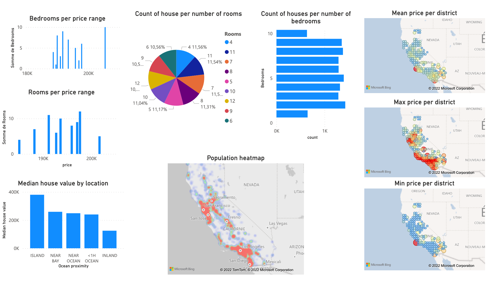

# Databricks / Azure Data Factory / PowerBI hands-on project
 
A data analysis on Jupyter notebooks running on Spark cluster on Databricks. Orchestration using Azure Data Factory. Reporting using PowerBI
 

---

